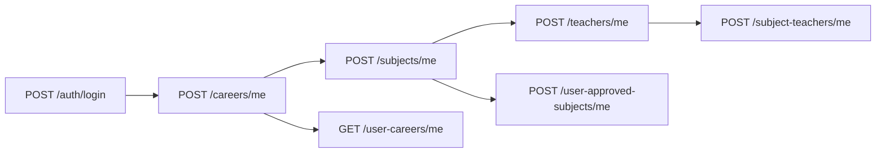

# API Guide para Frontend

Guía rápida de endpoints para consumir la API desde frontend (Ionic/Angular u otro).

- Base URL local: `http://localhost:3000`
- Swagger UI: `http://localhost:3000/docs`
- OpenAPI JSON: `http://localhost:3000/docs-json`
- Auth: `Bearer <access_token>` en header `Authorization`.

## Flujo de autenticación

1. Registrar o loguear usuario.
2. Guardar `access_token`.
3. Enviar token en cada request protegida.

### `POST /auth/register`

Body:

```json
{
  "name": "Juan Perez",
  "email": "usuario@ejemplo.com",
  "password": "Contrasena123"
}
```

Response (resumen):

```json
{
  "access_token": "jwt...",
  "user": {
    "id": "uuid",
    "name": "Juan Perez",
    "email": "usuario@ejemplo.com"
  }
}
```

### `POST /auth/login`

Body:

```json
{
  "email": "usuario@ejemplo.com",
  "password": "Contrasena123"
}
```

Response (resumen):

```json
{
  "access_token": "jwt...",
  "user": {
    "id": "uuid",
    "name": "Juan Perez",
    "email": "usuario@ejemplo.com",
    "careers": null
  }
}
```

`user.careers` puede traer la inscripción activa (`UserCareer`) si existe; no confundir con la lista de planes creados (`GET /careers/me`).

---

## Flujo recomendado para estudiante (STUDENT)

Orden típico al armar la app (onboarding + gestión):



| Paso | Endpoint | Qué hace |
|------|----------|----------|
| 1 | `POST /careers/me` | Crea **tu** carrera/plan (`ownerUserId` = tu usuario). Por defecto la activa (`UserCareer`). |
| 2 | `GET /careers/me` | Lista **solo** las carreras que tú creaste. |
| 3 | `POST /subjects/me` | Crea materia en una carrera **tuya** (`careerId`). |
| 4 | `GET /subjects/me` | Lista materias de **tus** carreras. |
| 5 | `POST /teachers/me` | Crea un profesor **tuyo** (no es cuenta de login). |
| 6 | `GET /teachers/me` | Lista **todos** los profesores que **tú** creaste. |
| 7 | `POST /subject-teachers/me` | Enlaza un `teacherId` **tuyo** con un `subjectId` **tuyo**. |
| 8 | `GET /subject-teachers/me` | Ver asignaciones profesor–materia de tu plan. |
| 9 | `GET /user-careers/me` | Ver carrera/cuatrimestre activos. |
| 10 | `POST /user-careers/me` | Cambiar a otra carrera **que tú creaste** (opcional). |
| 11 | `POST /user-approved-subjects/me` | Marcar materia en tu malla (plan activo). |

**Importante:** el estudiante **no** usa `GET /teachers` ni `POST /teachers` (solo admin). Para profesores propios: siempre **`/teachers/me`**.

---

## Reglas de permisos (resumen)

- **ADMIN**: catálogo global (`GET /careers`, `POST /careers`, `GET /teachers`, `POST /teachers`, etc.), materias de cualquier carrera, resto de módulos administrativos.
- **STUDENT**:
  - Crea **sus propias carreras** con institución (`POST /careers/me`). Solo ve las que él creó (`GET /careers/me`). `GET /careers/:id` solo si es dueño (`ownerUserId`).
  - Agrega **materias** solo a carreras propias (`POST /subjects/me`, `GET /subjects/me`). `quarterNumber` = cuatrimestre en el plan.
  - Crea **sus propios profesores** (`POST /teachers/me`) y los lista con `GET /teachers/me` (`ownerUserId` = su usuario). **No** puede usar profesores del catálogo admin.
  - Enlaza profesor + materia con `POST /subject-teachers/me` (materia y profesor deben ser **suyos**).
  - Horarios: `GET/POST/PATCH/DELETE` bajo `/subjects/:subjectId/schedules` si la materia es de **su** carrera.
  - `POST /user-careers/me`: activa o cambia inscripción; solo `careerId` de carreras **creadas por él**.
  - `user-approved-subjects/me`: la materia debe ser de **su** plan y de la **misma carrera** que su `UserCareer` activo.
- **Tasks**: JWT; cada usuario solo ve/edita sus tareas.

### Campos de “dueño” en el modelo

| Entidad | Campo | Significado |
|---------|--------|-------------|
| `Career` | `ownerUserId` | `null` = catálogo admin; `uuid` = plan creado por ese estudiante |
| `Teacher` | `ownerUserId` | `null` = catálogo admin; `uuid` = profesor creado por ese estudiante |

---

## Endpoints por módulo

## App

- `GET /`

## Users

- `POST /users`
- `GET /users`
- `GET /users/:id`
- `PATCH /users/:id`
- `DELETE /users/:id`
- `GET /users/:id/progress` (JWT, admin o propietario)
- `GET /users/:id/progress/summary` (JWT, admin o propietario)

## Careers

Cada carrera tiene **`institution`**. El mismo **nombre** puede repetirse entre instituciones o usuarios; el plan personal se identifica por **`ownerUserId`**.

| Método | Ruta | Rol | Descripción |
|--------|------|-----|-------------|
| `GET` | `/careers` | ADMIN | Todas las carreras |
| `GET` | `/careers/me` | STUDENT | Solo carreras **que tú creaste** |
| `POST` | `/careers/me` | STUDENT | Crear plan propio (+ activar inscripción) |
| `POST` | `/careers` | ADMIN | Catálogo (`ownerUserId` null) |
| `GET` | `/careers/:id` | JWT | Admin: cualquiera; estudiante: solo si es dueño |
| `PATCH` | `/careers/:id` | JWT | Admin: cualquiera; estudiante: solo sus carreras |
| `DELETE` | `/careers/:id` | JWT | Igual que PATCH |

Body base (`POST /careers` y `POST /careers/me`):

```json
{
  "name": "Ingenieria de Software",
  "institution": "Universidad Nacional",
  "description": "Carrera orientada al desarrollo de software",
  "totalCredits": 240,
  "totalSemester": 12
}
```

`totalSemester` = cantidad de **cuatrimestres** del plan. `totalCredits` puede ser `0` si no llevas control de créditos.

**Solo `POST /careers/me`** — campos opcionales:

```json
{
  "name": "Ingenieria de Software",
  "institution": "Universidad Nacional",
  "description": "...",
  "totalCredits": 240,
  "totalSemester": 12,
  "activate": true,
  "currentSemester": 1
}
```

- `activate` (default `true`): deja esta carrera como plan activo (`UserCareer`).
- `currentSemester`: cuatrimestre actual al activar (≤ `totalSemester`).

---

## Teachers (profesores)

Un **Teacher** no es un `User` con login: es un registro (`name`, `email` opcional). El estudiante crea los suyos y los asigna a materias.

| Método | Ruta | Rol | Descripción |
|--------|------|-----|-------------|
| `GET` | `/teachers/me` | STUDENT | **Lista todos los profesores que tú creaste** |
| `POST` | `/teachers/me` | STUDENT | Crear profesor propio |
| `GET` | `/teachers` | ADMIN | Catálogo global |
| `POST` | `/teachers` | ADMIN | Crear en catálogo (`ownerUserId` null) |
| `GET` | `/teachers/:id` | JWT | Admin: cualquiera; estudiante: solo si `ownerUserId` es él |
| `PATCH` | `/teachers/:id` | JWT | Admin: cualquiera; estudiante: solo sus profesores |
| `DELETE` | `/teachers/:id` | JWT | Igual que PATCH |

Body `POST /teachers/me` y `POST /teachers`:

```json
{
  "name": "Ana Martinez",
  "email": "ana@study.com"
}
```

`email` es opcional.

**Frontend:** pantalla “Mis profesores” → `GET /teachers/me`. Formulario “Nuevo profesor” → `POST /teachers/me`. Al asignar a una materia, usar un `id` devuelto por esa lista.

---

## Subjects (materias)

| Método | Ruta | Rol | Descripción |
|--------|------|-----|-------------|
| `GET` | `/subjects` | ADMIN | Todas |
| `GET` | `/subjects/me` | STUDENT | Materias de carreras con `ownerUserId` = tú |
| `POST` | `/subjects/me` | STUDENT | Crear en carrera **tuya** |
| `POST` | `/subjects` | ADMIN | Cualquier carrera |
| `GET` | `/subjects/:id` | JWT | Admin o dueño del plan de la materia |
| `PATCH` | `/subjects/:id` | JWT | Igual |
| `DELETE` | `/subjects/:id` | JWT | Igual |

### Modalidad (`modality`)

| Valor | Significado |
|-------|-------------|
| `IN_PERSON` | Presencial (default) |
| `VIRTUAL` | Virtual |
| `HYBRID` | Híbrida |

Si `modality` es `IN_PERSON` o `HYBRID`, son obligatorios `building`, `section`, `courseNumber` (strings no vacíos). En `VIRTUAL` se guardan como `null`.

**`quarterNumber`**: cuatrimestre en el plan; entre `1` y `totalSemester` de la carrera.

Body ejemplo (`POST /subjects` o `/subjects/me`):

```json
{
  "name": "Programacion I",
  "credits": 4,
  "quarterNumber": 1,
  "careerId": "career_uuid",
  "modality": "HYBRID",
  "building": "Edificio Central",
  "section": "A",
  "courseNumber": "PROG-2026-01"
}
```

Virtual:

```json
{
  "name": "Introduccion Web",
  "credits": 3,
  "quarterNumber": 1,
  "careerId": "career_uuid",
  "modality": "VIRTUAL"
}
```

Las respuestas incluyen `schedules` (horarios) y, según el include, `career`, `teachers`, etc.

---

## Horarios de materia (`/subjects/:subjectId/schedules`)

Varios bloques por materia (ej. lunes 08:00–10:00 y viernes 18:00–20:00).

### Días (`weekday`)

`MONDAY` … `SUNDAY`

| Método | Ruta | Acceso |
|--------|------|--------|
| `GET` | `/subjects/:subjectId/schedules` | Admin o dueño de la carrera |
| `POST` | `/subjects/:subjectId/schedules` | Idem |
| `PATCH` | `/subjects/:subjectId/schedules/:scheduleId` | Idem |
| `DELETE` | `/subjects/:subjectId/schedules/:scheduleId` | Idem |

Body `POST` / `PATCH`:

```json
{
  "weekday": "FRIDAY",
  "startTime": "18:00",
  "endTime": "20:00",
  "room": "Lab 2"
}
```

`startTime` / `endTime`: **`HH:mm`** (24 h). Fin > inicio.

En JSON, Prisma puede devolver horas como ISO (`1970-01-01T18:00:00.000Z`); el front puede leer UTC o formatear.

---

## Subject Teachers (profesor ↔ materia)

| Método | Ruta | Rol | Descripción |
|--------|------|-----|-------------|
| `GET` | `/subject-teachers/me` | STUDENT | Asignaciones donde la materia es de **tus** carreras |
| `POST` | `/subject-teachers/me` | STUDENT | Enlazar profesor **tuyo** + materia **tuya** |
| `GET` | `/subject-teachers` | ADMIN | Todas |
| `POST` | `/subject-teachers` | ADMIN | Cualquier par válido |
| `GET` | `/subject-teachers/:id` | JWT | Admin; estudiante si la materia es suya |
| `PATCH` | `/subject-teachers/:id` | JWT | Idem |
| `DELETE` | `/subject-teachers/:id` | JWT | Idem |

Body `POST` / `POST …/me`:

```json
{
  "subjectId": "subject_uuid",
  "teacherId": "teacher_uuid"
}
```

**Estudiante:**

- `subjectId`: materia de carrera con `ownerUserId` = tu `userId`.
- `teacherId`: profesor con `ownerUserId` = tu `userId` (creado con `POST /teachers/me`).

**409** si el par `subjectId` + `teacherId` ya existe.

---

## User Careers (inscripción activa)

| Método | Ruta | Rol |
|--------|------|-----|
| `GET` | `/user-careers/me` | STUDENT — tu inscripción actual (o `null`) |
| `POST` | `/user-careers/me` | STUDENT — elegir/cambiar carrera **propia** |
| `GET` | `/user-careers/:id` | ADMIN cualquiera; STUDENT solo si `userId` es él |
| `GET` | `/user-careers` | ADMIN |
| `GET` | `/user-careers/user/:userId` | ADMIN |
| `POST` | `/user-careers` | ADMIN |
| `PATCH` | `/user-careers/:id` | ADMIN |
| `DELETE` | `/user-careers/:id` | ADMIN |

Body `POST /user-careers/me`:

```json
{
  "careerId": "career_uuid",
  "currentSemester": 1
}
```

`currentSemester` ≤ `totalSemester` de la carrera. Si ya había inscripción, se **actualiza** (no 409).

---

## User Semesters

- `GET /user-semesters` (JWT)
- `GET /user-semesters/:id` (JWT)
- `POST /user-semesters` (JWT + ADMIN)
- `PATCH /user-semesters/:id` (JWT + ADMIN)
- `DELETE /user-semesters/:id` (JWT + ADMIN)

Body:

```json
{
  "userCareerId": "user_career_uuid",
  "number": 2,
  "isActive": true
}
```

---

## Tasks

- `GET /tasks` (JWT) — solo las del usuario del token
- `GET /tasks/:id` (JWT)
- `POST /tasks` (JWT)
- `PATCH /tasks/:id` (JWT)
- `DELETE /tasks/:id` (JWT)

Body:

```json
{
  "title": "Practica de funciones",
  "description": "Capitulo 1",
  "dueDate": "2026-05-20T23:59:00.000Z",
  "subjectId": "subject_uuid"
}
```

`userId` no se envía; viene del JWT.

---

## User Approved Subjects (malla / materias cursando)

### Estudiante (`STUDENT`)

Requisitos para `POST /user-approved-subjects/me`:

1. Tener inscripción activa (`UserCareer`), normalmente tras `POST /careers/me` con `activate: true` o `POST /user-careers/me`.
2. La materia debe ser de una carrera **creada por ti** (`career.ownerUserId` = tu id).
3. La materia debe pertenecer a la **misma carrera** que tu `UserCareer.careerId`.

| Método | Ruta | Descripción |
|--------|------|-------------|
| `GET` | `/user-approved-subjects/me` | Tus inscripciones (incluye `subject` y `career`) |
| `POST` | `/user-approved-subjects/me` | Agregar materia |
| `DELETE` | `/user-approved-subjects/me/:id` | Quitar inscripción (`:id` = id del registro, no `subjectId`) |

Body `POST`:

```json
{
  "subjectId": "subject_uuid"
}
```

Errores: **401** sin token; **403** materia de otra carrera o plan ajeno; **409** ya inscripto.

### Admin

- `GET /user-approved-subjects`
- `GET /user-approved-subjects/:id`
- `POST /user-approved-subjects` (ADMIN)
- `PATCH /user-approved-subjects/:id` (ADMIN)
- `DELETE /user-approved-subjects/:id` (ADMIN)

Body admin create:

```json
{
  "userId": "user_uuid",
  "subjectId": "subject_uuid",
  "approvedAt": "2026-05-07T10:00:00.000Z"
}
```

`approvedAt` opcional.

---

## Códigos HTTP frecuentes

| Código | Cuándo |
|--------|--------|
| **401** | Sin token, token inválido o expirado |
| **403** | Rol incorrecto o recurso de otro usuario |
| **404** | Id inexistente o ruta mal ordenada (usar `/me` antes de `/:id`) |
| **409** | Duplicado (ej. mismo profesor en la misma materia) |
| **400** | Validación (cuatrimestre, modalidad, campos obligatorios) |

---

## Datos de prueba (seed)

Tras migraciones y seed (Docker):

```bash
docker compose exec api npx prisma migrate deploy
docker compose exec api npx prisma db seed
```

Contraseña común: **`12345678`**.

| Usuario | Rol | Uso |
|---------|-----|-----|
| `admin@study.com` | ADMIN | Catálogo, `GET /careers`, `GET /teachers`, etc. |
| `student@study.com` | STUDENT | Plan propio, materias, **profesores con `ownerUserId` del estudiante**, horarios, tareas |
| `maria@study.com` | STUDENT | Plan corto UX (1 cuatrimestre) |

El seed imprime IDs útiles en consola. Si falla con tabla inexistente, aplicar migraciones primero.

---

## Docker y URL en el front

- API en Docker: `http://localhost:3000` desde el navegador.
- Emulador Android: suele requerir `http://10.0.2.2:3000` o la IP de tu PC.
- Tras cambios en el backend: `docker compose build api && docker compose up -d api`.

---

## Generación de cliente frontend (opcional)

1. API arriba.
2. OpenAPI: `http://localhost:3000/docs-json`.
3. Ejemplo:

```bash
npx openapi-typescript http://localhost:3000/docs-json -o src/api/generated.ts
```
